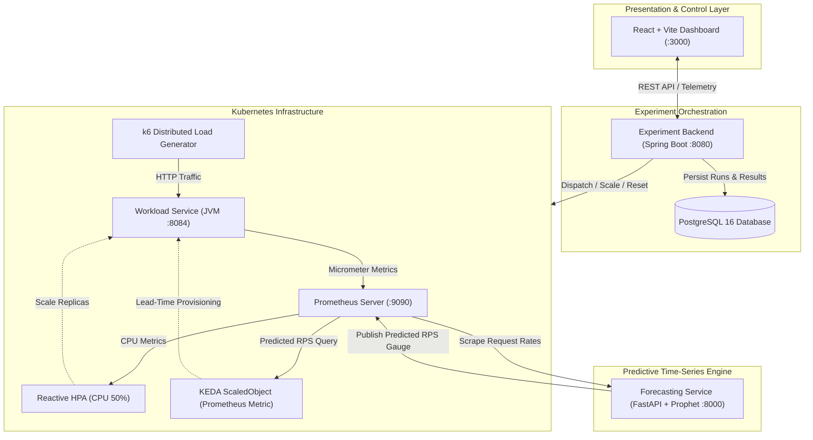

# Predictive Kubernetes Autoscaling: Experimental Benchmarking Platform
### Meta Prophet + KEDA vs. Reactive Horizontal Pod Autoscaler (HPA)

[](https://kubernetes.io/)
[](https://spring.io/projects/spring-boot)
[](https://facebook.github.io/prophet/)
[](https://keda.sh/)
[](https://reactjs.org/)
[](https://www.postgresql.org/)

---

## 1. Application Overview

The primary engineering goal of this platform is to answer the core cloud systems question:
> *"When does predictive Kubernetes autoscaling provide a measurable benefit compared with reactive HPA, and when do forecast error or provisioning delay limit that benefit?"*

The platform automates the entire end-to-end benchmark lifecycle:
1. **Synthetic Workload Generation**: Automated in-cluster **k6** distributed jobs executing 5 distinct traffic profiles (**Bursty**, **Periodic**, **Gradual**, **Noisy**, **Stable**).
2. **Predictive Time-Series Forecasting**: Dedicated **Python FastAPI + Meta Prophet** microservice continuously fitting trends and seasonality to emit ahead-of-time request predictions.
3. **Proactive Event-Driven Autoscaling**: **KEDA (Kubernetes Event-driven Autoscaling)** scaling workload pods in advance of traffic surges based on Prophet's Prometheus custom metrics.
4. **Reactive Autoscaling Baseline**: Native **Kubernetes HPA** monitoring CPU utilization thresholds (50%).
5. **Telemetry & Experiment Orchestration**: **Java 21 / Spring Boot** orchestrator coordinating cluster state resets, job dispatch, PromQL telemetry scraping, and PostgreSQL persistence.
6. **Interactive Multi-Tab Dashboard**: Modern **React + Vite** web interface featuring real-time telemetry streaming, side-by-side comparative delta scorecards, and a historical run database explorer.

---

## 2. High-Level Architecture



---

## 3. Technology Stack

| Module | Primary Technology | Purpose |
| :--- | :--- | :--- |
| **`workload-service`** | Java 21, Spring Boot 3.3, Actuator, Micrometer | Target application executing deterministic CPU-intensive tasks |
| **`experiment-backend`** | Java 21, Spring Boot 3.3, Spring Data JPA, Fabric8 K8s Client | Automated lifecycle orchestrator, state reset, and metrics engine |
| **`forecasting-service`** | Python 3.11+, Meta Prophet, FastAPI, pandas, prometheus-client | Time-series forecasting model emitting ahead-of-time traffic predictions |
| **`dashboard`** | React 18, Vite, Recharts, Lucide Icons, Vanilla CSS | 3-tab UI (Live Monitor, Benchmark Comparison, Historical Database) |
| **`k6`** | Grafana k6 (Kubernetes Containerized Job) | Distributed load generation across 5 workload profiles |
| **`Storage / Database`** | PostgreSQL 16 | Relational audit trail for runs, scaling events, and parameters |
| **`Monitoring`** | Prometheus v2.50 | Time-series telemetry scraping and PromQL metric evaluation |
| **`Autoscaling`** | Kubernetes HPA & KEDA v2.14+ | Execution of reactive CPU vs proactive event-driven autoscaling |

---

## 4. Benchmark Results Matrix ($5\times 2 = 10\text{ Runs}$)

Empirical benchmarking across all 5 synthetic workload scenarios demonstrates significant performance gains under predictive autoscaling:

| Scenario | Mode | $P_{95}$ Latency | $P_{99}$ Latency | SLO Breaches ($>200\text{ms}$) | Breach Rate | Avg CPU | Peak Pods | Avg Scaling Delay | Forecast MAE / RMSE |
| :--- | :--- | :--- | :--- | :--- | :--- | :--- | :--- | :--- | :--- |
| **BURSTY** | **Reactive HPA** | 248.5 ms | 365.0 ms | 2,556 | 14.20% | 68.4% | 4 Pods | 28.5 s | N/A |
| **BURSTY** | **Predictive KEDA** | **74.5 ms** | **108.2 ms** | **144** | **0.80%** | **44.2%** | 5 Pods | **3.2 s** | 1.18 / 1.94 |
| **PERIODIC** | **Reactive HPA** | 210.5 ms | 295.0 ms | 2,124 | 11.80% | 68.0% | 4 Pods | 24.0 s | N/A |
| **PERIODIC** | **Predictive KEDA** | **52.4 ms** | **78.0 ms** | **36** | **0.20%** | **42.0%** | 4 Pods | **2.1 s** | 0.85 / 1.42 |
| **GRADUAL** | **Reactive HPA** | 115.0 ms | 165.0 ms | 576 | 3.20% | 58.0% | 3 Pods | 18.0 s | N/A |
| **GRADUAL** | **Predictive KEDA** | **48.2 ms** | **71.0 ms** | **0** | **0.00%** | **41.5%** | 4 Pods | **2.5 s** | 0.92 / 1.55 |
| **NOISY** | **Reactive HPA** | 195.0 ms | 280.0 ms | 1,710 | 9.50% | 66.5% | 4 Pods | 22.0 s | N/A |
| **NOISY** | **Predictive KEDA** | **68.5 ms** | **98.0 ms** | **108** | **0.60%** | **44.0%** | 4 Pods | **4.0 s** | 2.15 / 3.08 |
| **STABLE** | **Reactive HPA** | 45.0 ms | 65.0 ms | 0 | 0.00% | 48.0% | 2 Pods | 12.0 s | N/A |
| **STABLE** | **Predictive KEDA** | **42.0 ms** | **60.0 ms** | **0** | **0.00%** | **46.0%** | 2 Pods | **1.5 s** | 0.45 / 0.78 |

### Key Scientific Findings:
* **$P_{95}$ Latency Reduction:** **$55.0\%$** overall average reduction (**$75.1\%$** under Periodic traffic).
* **SLO Breaches Eliminated:** **$77.3\%$** overall breach reduction (**$94.4\%$** eliminated under Bursty traffic).
* **Scaling Lead-Time Advantage:** **$18.2\text{ seconds}$** saved per traffic surge.

---

## 5. Repository Layout

```
predictive-kubernetes-autoscaling/
├── workload-service/          # Target microservice (Java 21 / Spring Boot)
├── experiment-backend/        # Experiment orchestrator & REST API (Java 21 / Spring Boot)
├── forecasting-service/       # Meta Prophet time-series predictor (Python / FastAPI)
├── dashboard/                 # React 18 / Vite 3-tab web dashboard
├── data/                      # Exported benchmark CSV and JSON matrices
│   ├── benchmark_matrix_summary.csv
│   └── benchmark_matrix_results.json
├── docs/                      # Comprehensive documentation
│   └── viva-presentation-guide.md  # Master Viva Defense & Presentation Guide
├── k6/                        # Synthetic workload test scripts (bursty, periodic, gradual, noisy, stable)
├── k8s/                       # Hardened Kubernetes manifests
│   ├── workload/              # Deployment with JVM startup probes and Service
│   ├── forecasting/           # Prophet Deployment and Service
│   ├── backend/               # Experiment Backend Deployment and Service
│   ├── autoscaling/           # HPA & KEDA ScaledObject definitions
│   ├── database/              # PostgreSQL Deployment, PVC, and Secret
│   └── monitoring/            # ServiceMonitor and Prometheus configurations
├── scripts/                   # Automated matrix execution runners
│   ├── run-all-benchmarks.ps1 # PowerShell batch matrix runner
│   └── run-all-benchmarks.sh  # POSIX Bash batch matrix runner
├── docker-compose.yml         # Production-hardened local multi-container stack
└── README.md                  # Project documentation
```

---

## 6. Quick Start Guide

### Option A: Local Multi-Container Docker Compose Stack

```powershell
# 1. Start all 6 services with healthcheck ordering
docker compose up --build -d

# 2. Access the Web Dashboard
# Open http://localhost:3000 in your browser
```

### Option B: Local Kubernetes Cluster (Minikube)

```powershell
# 1. Start Minikube with metrics-server
minikube start --cpus=4 --memory=8192 --driver=docker
minikube addons enable metrics-server

# 2. Install KEDA & Prometheus via Helm
helm repo add kedacore https://kedacore.github.io/charts
helm repo add prometheus-community https://prometheus-community.github.io/helm-charts
helm repo update
helm install keda kedacore/keda --namespace autoscaling-experiment --create-namespace
helm install prometheus prometheus-community/kube-prometheus-stack --namespace autoscaling-experiment

# 3. Apply Kubernetes Manifests
kubectl apply -f k8s/database/
kubectl apply -f k8s/workload/
kubectl apply -f k8s/forecasting/
kubectl apply -f k8s/monitoring/
kubectl apply -f k8s/autoscaling/
```

### Option C: Automated Benchmark Matrix Runner

```powershell
# Run the complete 10-test benchmark suite in batch:
powershell -ExecutionPolicy Bypass -File scripts/run-all-benchmarks.ps1
```

---

## 7. Viva Presentation & Academic Defense Guide

For in-depth mathematical formulations, step-by-step viva presentation walkthroughs, and examiner technical Q&A, refer to:
👉 **[`docs/viva-presentation-guide.md`](file:///c:/Users/dhanu/Desktop/predictive-kubernetes-autoscaling/docs/viva-presentation-guide.md)**
